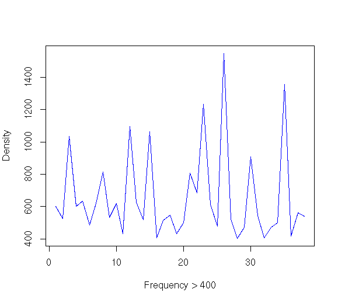
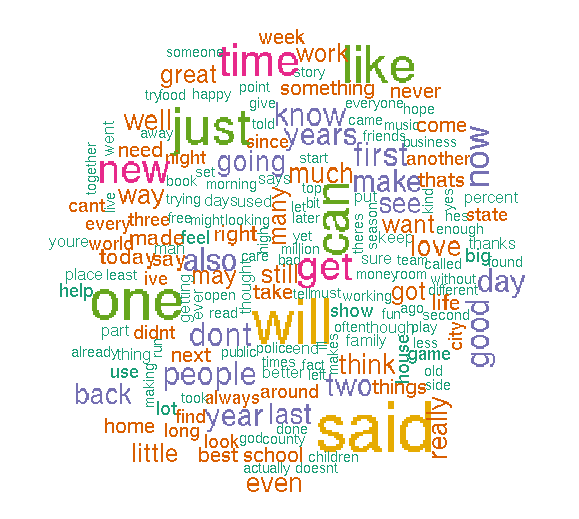

```{r setup, include=FALSE}
knitr::opts_chunk$set(echo = FALSE)
```

# Overview
The Data Science Specialization, offered by Johns Hopkins University through Coursera, consists of nine courses, and culminates in a tenth course known as the Capstone Project. The ultimate goal of the Capstone project is to produce a Shiny Web application which provides a reasonable prediction of candidate words based on user input, similar to that done by products from __SwiftKey__, a leading provider of intuitive and personalized keyboard software.  In so doing, the knowledge and techniques acquired via the previous nine courses will be utilized and demonstrated in the process. 

This Milestone report provides comprehensive information regarding the work done midway through the Capstone Project towards achieving the stated goal.  It will describe the data used in the project, the data cleansing techniques applied, the summary statistics calculated on the cleansed data, and the suggested approaches for predictive algorithms, among other things.

# Datasets
The datasets used in this project are from a corpus called __HC Corpora__ and are available [here](https://d396qusza40orc.cloudfront.net/dsscapstone/dataset/Coursera-SwiftKey.zip); information, what little there is, about the corpus can be found at this [site](https://web.archive.org/web/20160522150305/http://www.corpora.heliohost.org/aboutcorpus.html).  

It takes approximately 30 minutes to download the zip file over a standard Wi-Fi connection.  Once downloaded, the zipped file was extracted into a directory local to the Capstone project files.  The zip file contains a top-level directory named __final__.  Within __final__ are four sub-directories housing datasets for each of these languages:  

* English
* German 
* Russian
* Finnish

The project will examine only the English datasets, so the other three were deleted.  The following table summarizes some statistics about the English datasets:

```{r datasets}
column.names <- c("Filename", "#Lines", "#Words", "#Characters", "#Longest Line")
dataset.data <- data.frame(c("en_US.blogs.txt", "en_US.news.txt", "en_US.twitter.txt"),
                           c(899288, 1010242, 2360148),
                           c(37334117, 34365936, 30373559),
                           c(208623081, 205243643, 166816544),
                           c(40833, 11384, 173))
library(knitr)
kable(dataset.data, caption = "Dataset Metrics", col.names = column.names)
```

# Data Import
The environment and packages used to process the data after download and extraction are described next.

## Processing Environment
The datasets were housed and processed on a Dell Latitude E6530 laptop with 15.5 GiB of memory and an Intel® Core™ i7-3520M CPU @ 2.90GHz × 4 processor.  The OS in use is a 64-bit version of Ubuntu 16.04.

## Packages used
This project makes extensive use of the text mining framework provided by the [__tm__^1^] [tm_pdf] package for data import, cleansing, matrix manipulation, and correlative information about the data.  In addition, the [__wordcloud__^2^] [wordcloud_pdf] package is used to visualize high-frequency words using color-weighting.  Finally, the [__RWeka__^3^] [RWeka_pdf] package is an R interface to _Weka_, a collection of machine learning algorithms for data mining tasks written in Java, containing tools for data pre-processing, classification, regression, clustering, association rules, and visualization.

[tm_pdf]: https://cran.r-project.org/web/packages/tm/tm.pdf  "tm Reference"
[wordcloud_pdf]: https://cran.r-project.org/web/packages/wordcloud/wordcloud.pdf "wordcloud Reference"
[RWeka_pdf]: https://cran.r-project.org/web/packages/RWeka/RWeka.pdf "RWeka Reference"

## Load timing
Several techniques were considered for loading the datasets.  Eventually, the methods provided by the __tm__ package proved reliable and fast enough to load the entire 3 datasets into a corpus:
```
corpora <- Corpus(DirSource(dataFiles))
```
Timings were taken, showing roughly 2 minutes to load all 3 files into memory:
```{r loadtime}
column.names <- c("user", "system", "elapsed")
dataset.data <- data.frame(c(123.924),
                           c(0.804),
                           c(124.618))
library(knitr)
kable(dataset.data, caption = "Source System: Dell Latitude E6530 Laptop", col.names = column.names)
```

No corruption of the data was encountered, nor were any errors issued during the data import process.  The following table shows a reduction in the number of characters from what was originally reported.  The percentage of potential data lossage is not significant enough to warrant further investigation, as the population is sufficiently large enough for analysis.

```{r characters}
column.names <- c("Corpus ID", "#Characters")
dataset.data <- data.frame(c("en_US.blogs.txt", "en_US.news.txt", "en_US.twitter.txt"),
                           c(206824505, 203223159, 162096031))
library(knitr)
kable(dataset.data, caption = "Post-Import Corpora Statistics", col.names = column.names)
```

# Data samples
The data is largely plain-text, with various forms of punctuation and digits interspersed.  Although an effort was made to filter the text according to the source language, a few aberrant Unicode and other non-alphabetic characters still remain, as the following sections show.

## Extract from each dataset
A typical line, using the *en_US.news.txt* dataset, looks like this:
```
"The Alaimo Group of Mount Holly was up for a contract last fall to evaluate and suggest improvements to Trenton Water Works. But campaign finance records released this week show the two employees donated a total of $4,500 to the political action committee (PAC) Partners for Progress in early June. Partners for Progress reported it gave more than $10,000 in both direct and in-kind contributions to Mayor Tony Mack in the two weeks leading up to his victory in the mayoral runoff election June 15."
```
## Data anomalies
An example of an emoticon (or _emoji_) which appears in the *en_US.twitter.txt* dataset is shown below:
```
"I'm doing it!👦"   
```
An example of Unicode text which can be found in the *en_US.news.txt* dataset is shown here:
```
"\u0093I was just trying to hit it hard someplace,\u0094 said Rizzo, who hit the pitch to the opposite field in left-center. \u0093I\u0092m just up there trying to make good contact.\u0094"
```
# Preprocessing steps
Before any meaningful data mining work can be done, the corpora needs to be cleansed a bit further.  There are several standards steps perfomed in most data mining efforts; most of them are listed in the next sub-section.

## Helper function
In order to efficiently remove certain undesired patterns in the data, a **content_transformer** (i.e., a function which modifies the content of an R object) is assigned to an R variable.  This **content_transformer** is defined with a simple function to replace undesired patterns with a blank and will be passed to the **tm_map** method of the **tm** package.
```
#
# Convert the specified pattern to blank, given a vector
#
toBlank <- content_transformer(function(x, pattern) {return (gsub(pattern, "", x))})
```
## Data cleansing approach
The standard steps for cleaning the corpora are self-explanatory and listed in the code segment below:
```
# Remove punctuation and digits
corpora <- tm_map(corpora, toBlank, "[[:punct:][:digit:]]")

# Transform to lower case (need to wrap in content_transformer)
corpora <- tm_map(corpora, content_transformer(tolower))

# Remove stopwords
corpora <- tm_map(corpora, removeWords, stopwords("english"))

# Remove whitespace
corpora <- tm_map(corpora, stripWhitespace)

# But there is still leading whitespace (and maybe trailing?)
corpora <- tm_map(corpora, toBlank, "^[ \t]+|[ \t]+$")

# Remove all blank lines
corpora <- tm_map(corpora, toBlank, "^[[:blank:]*]$")

# Now all data is in lowercase but there are some non-Latin characters to remove
corpora <- tm_map(corpora, toBlank, "[^a-z ]")
```

Finally, once this level of cleansing is done, words of an offensive nature (not listed here) are removed using a similar technique with **tm_map** and the **toBlank** function.  The list of offensive words is by no means comprehensive but does seek to exclude the more common (and most offensive) words potentially contained in the corpora.

__Note:__ Stemming was not performed on this corpora due to processing efficiency issues.

# Summary statistics
Now that the population has been sanitized, the EDA and statistical analysis can begin.  

## Population sampling
First action is to take a reasonably sized sample from the population, keeping in mind that setting a seed in the __take.sample__ function will enforce reproducible results:
```
# Sample from the population
sample.size <- 5000
total.sample <- c(take.sample(corpora[[1]]$content, sample.size),
                  take.sample(corpora[[2]]$content, sample.size),
                  take.sample(corpora[[3]]$content, sample.size))

```
## Sample-based Corpus
Next, construct a __VCorpus__ (A volatile corpus, or VCorpus, is fully kept in memory and thus all changes only affect the corresponding R object.) from the sample so that a __DocumentTermMatrix__ can be constructed from it.
```
# Construct a VCorpus from the sampling
corpora.sample <- VCorpus(VectorSource(total.sample))
```
## Construction of a DocumentTermMatrix
A __DocumentTermMatrix__ is, as its name hints at, a matrix in which all the rows are documents and all columns are terms contained in those documents.  It takes about 16 seconds to construct a DocumentTermMatrix from the sample:
```
# Construct a DTM from the sample
dtm <- DocumentTermMatrix(corpora.sample)
```
This DocumentTermMatrix has the following characteristics:
```
Number of documents: 15000
Number of terms:     34895
Non-/sparse entries: 219530/523205470
Sparsity           : 100%
```
As with most text-mining efforts, the matrices tend to be sparse. Efforts to reduce the sparsity and compact the matrix produced little of value:
```
removeSparseTerms(dtm, 0.99994)
<<DocumentTermMatrix (documents: 15000, terms: 35179)>>
Non-/sparse entries: 219859/527465141
Sparsity           : 100%
```
## Term Frequency and Correlation analysis
The __tm__ package provides a method for determining the frequency for words within a bounded range as well as the correlation of a word against all the documents in the corpus.  As an example for the first, determine which words occur at least 500 times but no more than 1000 times:
```
findFreqTerms(dtm, lowfreq = 500, highfreq = 1000)
 [1] "also"   "back"   "day"    "dont"   "first"  "get"    "going"  "good"  
 [9] "know"   "last"   "love"   "make"   "much"   "new"    "now"    "people"
[17] "see"    "time"   "two"    "well"   "year"   "years"
```
As an example for the second, one word from the previous list will be selected and used as input to the __findAssocs__ method.  This method also accepts a correlation parameter which ranges in value from 0 to 1.  With a value of Z = 1, the term ALWAYS occurs with some other word in the corpus; that probability decreases as the value moves closer to zero.  It is __NOT__ an indicator of nearness as the DTM is just a "bag of words".
```
term <- "two"
Z <- 0.1
findAssocs(dtm, term, Z)
$two
     agonizing commotionuntil         culled          fuzzy        lilburn 
          0.12           0.12           0.12           0.12           0.12 
      mullinax       prettier       roosters        suwanee         techie 
          0.12           0.12           0.12           0.12           0.12 
     wyandotte      bannister        innings    predictable 
          0.12           0.11           0.11           0.10 
```
## Summary Statistics
Since the columns of the matrix are the frequency counts of each word across all documents, the sums of those frequency counts can be obtained and ordered from highest to lowest:
```
# Calculate the frequency of each word
freq <- colSums(as.matrix(dtm))

# Create sort order (descending)
freq.order <- order(freq, decreasing = TRUE)

# List most/least frequent terms
# Or least/most unique terms
freq[head(freq.order)]
said will  one just like  can 
1548 1355 1235 1096 1062 1033 

freq[tail(freq.order)]
zuerlein   zunino   zurich     zusi zweerman zydrunas 
       1        1        1        1        1        1 
```
The classic "5-number summary" shows that the data is __heavily__ skewed to the right:
```
 Min.  1st Qu.   Median     Mean  3rd Qu.     Max. 
   1.000    1.000    1.000    6.749    3.000 1548.000
```
_Standard Deviation_ is the best measure of spread of an approximately normal distribution. This is not the case when there are extreme values in a distribution or when the distribution is skewed, as in the situation here.  So, neither standard deviation nor variance are calculated for this data.

Finally, a plot of the distribution of words that occur more than 400 in the sample is shown below:; it shows a definite skewing to the right:

# Wordcloud
A word cloud is a visual representation of text data, typically used to visualize free form text, as well as other text-based data sources like website metadata.  Here is a wordcloud of the words in the sample having a minimum frequence of 150 occurrences.



# Prediction algorithm
Further analysis of the sample data will be done using __n-grams__.  An _n_-gram is a contiguous sequence of _n_ items from a given sequence of text or speech. An _n_-gram of size 1 is referred to as a "unigram"; size 2 is a "bigram" (or, less commonly, a "digram"); size 3 is a "trigram". Larger sizes are sometimes referred to by the value of _n_, e.g., "four-gram", "five-gram", and so on.  An example of the code (using the __RWeka__ package method _NGramTokenizer_) that will be used to perform this analysis follows; it is unlikely that an _n_-gram higher than three will be used:
```
unigramTokenizer <- function(x) NGramTokenizer(x, Weka_control(min=2, max=1))
bigramTokenizer <- function(x) NGramTokenizer(x, Weka_control(min=2, max=2))
trigramTokenizer <- function(x) NGramTokenizer(x, Weka_control(min=3, max=3))
```
Using this method, the following results were obtained:

### Top 10 Unigrams
```
  the    to   and     a    of    in     i  that    is   for 
22002 11782 11123 10511  9489  7552  6781  4669  4501  4485 
```

### Top 10 Bigrams
```
 of_the   in_the   to_the   on_the  for_the    to_be  and_the   at_the     in_a 
    2021     1900      955      855      829      684      617      615      570 
with_the 
     523 
```
### Top 10 Trigrams
```
 one_of_the    a_lot_of  as_well_as  out_of_the   i_want_to going_to_be  the_end_of some_of_the 
        159         134          83          75          72          70          70          68 
   it_was_a  be_able_to 
         66          58 
```
# Shiny Application
The UI for testing the prediction algorithm will be coded using the Shiny API and hosted on the shinyapps.io website.  No wireframes have been produced yet, but the initial thoughts on design is to have a very simple UI with an input text field, an output field for the predicted next word, and some usage information.

#### __References__:
##### 1. [*Introduction to the __tm__ Package*](https://cran.r-project.org/web/packages/tm/vignettes/tm.pdf)
##### 2. [*Text mining and word cloud fundamentals in R : 5 simple steps you should know*](http://www.sthda.com/english/wiki/text-mining-and-word-cloud-fundamentals-in-r-5-simple-steps-you-should-know)
##### 3. [*RWeka Odds and Ends*](https://cran.r-project.org/web/packages/RWeka/vignettes/RWeka.pdf)